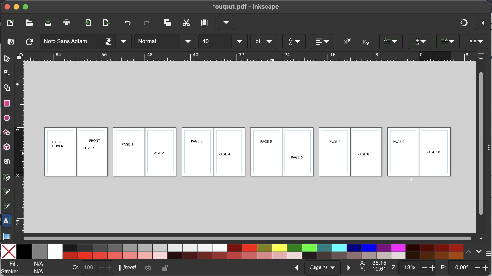
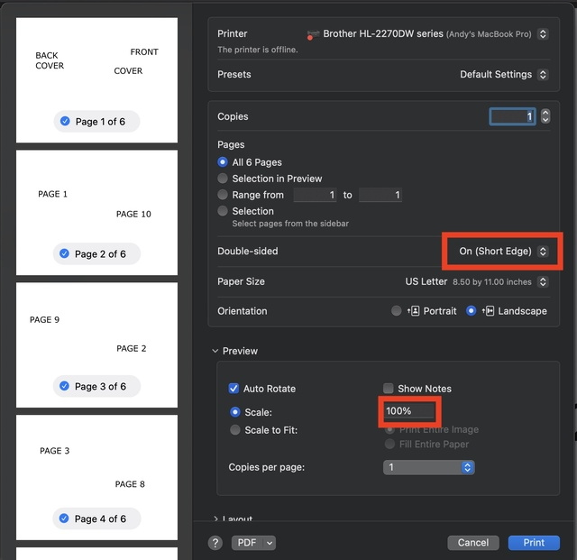

# zinescape
tools for making zines with inkscape


# installation

- install python
- `pip install setuptools`
- run `pip install .`

# usage

- create a blank template with zinescape
- edit in inkscape
- save the pdf
- compile the booklet pdf with zinescape
- print and fold

## `zinescape template`

this command makes a blank zine template for inkscape. options:

- N=<number of pages,>
- W=<width of page, inches>
- H=<height of page, inches>

```bash
./zinescape.sh template output.pdf n=12
```

the first two pages are the front and back cover - then 10 pages of content



## `zinescape compile`

this command takes a .pdf file you've saved from inkscape and arranges it into a zine format. also does image compression. autogenerates output filenames (e.g. `final-book.pdf`, `final-book_compressed.pdf`)

```bash
./zinescape.sh compile final.pdf n=12
```

## printing

for best results, print using "actual size" or "100%" scaling, double-sided. Check whether you should do short-edge or long-edge binding (might vary). After printing, fold in half and staple in the middle.



# notes

- doesn't support metric (yet?)
- only does single fold flip
